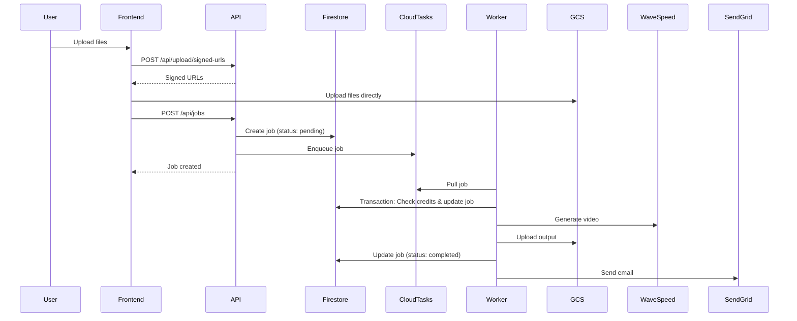
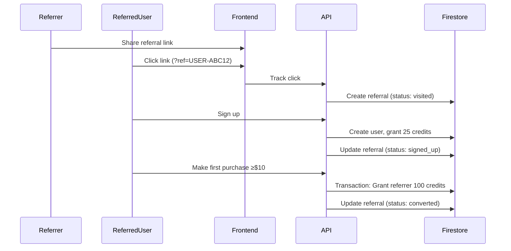

# NuuMee.AI Firestore Database Schema

**Database:** Firestore (Native Mode)
**Project:** nuumee-66a48
**Created:** 2025-01-21

---

## Table of Contents

1. [Collections Overview](#collections-overview)
2. [Collection Schemas](#collection-schemas)
3. [Composite Indexes](#composite-indexes)
4. [Security Rules](#security-rules)
5. [Transaction Patterns](#transaction-patterns)
6. [Data Flow Diagrams](#data-flow-diagrams)

---

## Collections Overview

| Collection | Purpose | Estimated Size | Critical Indexes |
|------------|---------|----------------|------------------|
| `users` | User profiles, credits, subscriptions | 100K docs | `email`, `referral_code` |
| `jobs` | Video generation jobs | 1M docs/year | `user_id + created_at`, `status + created_at` |
| `credit_transactions` | Credit history | 5M docs/year | `user_id + timestamp` |
| `subscriptions` | Active subscriptions | 10K docs | `user_id`, `stripe_subscription_id` |
| `referrals` | Referral tracking | 50K docs | `referrer_id`, `referred_user_id`, `referral_code` |
| `referral_codes` | Unique code lookup | 100K docs | `code` (unique) |
| `affiliates` | Affiliate accounts | 1K docs | `user_id`, `status` |
| `affiliate_clicks` | Click tracking | 100K docs/month | `affiliate_id + timestamp` |
| `affiliate_conversions` | Conversion tracking | 10K docs/month | `affiliate_id + timestamp` |
| `affiliate_payouts` | Payout history | 500 docs/month | `affiliate_id + created_at` |
| `api_keys` | API key management | 5K docs | `user_id`, `key_hash` |
| `webhooks` | Webhook configs | 1K docs | `user_id` |
| `payment_methods` | Stripe payment methods | 20K docs | `user_id`, `stripe_payment_method_id` |
| `system` | System config & counters | 10 docs | N/A |

---

## Collection Schemas

### 1. `users/{userId}`

**Purpose:** User profiles, credits, subscription info

**Document Structure:**
```typescript
{
  // Identity
  user_id: string,                    // Firebase Auth UID
  email: string,                      // Primary email (indexed)
  email_verified: boolean,
  display_name: string | null,
  username: string | null,            // Unique, optional (indexed if set)
  avatar_url: string | null,

  // Profile
  company: string | null,
  location: string | null,
  bio: string | null,                 // Max 500 chars

  // Credits & Billing
  credits_balance: number,            // Current balance (default: 25 for new users)
  subscription_tier: "free" | "creator" | "studio",
  stripe_customer_id: string | null,

  // Founding Member Program
  founding_member: boolean,           // First 100 paying subscribers
  founding_discount: number,          // 0.20 = 20% lifetime discount
  founding_joined_at: timestamp | null,
  founding_number: number | null,     // 1-100

  // Referral System
  referral_code: string,              // USER-XXXXX (unique, indexed)
  referred_by: string | null,         // Referral code that referred this user
  referral_bonus_claimed: boolean,    // 25 credits claimed
  referrer_bonus_paid: boolean,       // 100 credits paid to referrer

  // Affiliate Program
  is_affiliate: boolean,
  affiliate_status: "none" | "pending" | "approved" | "rejected",
  affiliate_code: string | null,      // AFF-XXXXX (if approved)

  // Notification Preferences
  notifications: {
    email_on_completion: boolean,
    email_on_failure: boolean,
    email_on_low_credits: boolean,
    email_on_billing: boolean,
    email_product_updates: boolean,
    email_marketing: boolean,
    browser_notifications: boolean,
  },

  // Webhook
  webhook_url: string | null,
  webhook_secret: string | null,
  webhook_events: string[],           // ["job.completed", "job.failed", "credits.low"]

  // Metadata
  created_at: timestamp,
  updated_at: timestamp,
  last_login_at: timestamp,
}
```

**Example:**
```json
{
  "user_id": "abc123uid",
  "email": "user@example.com",
  "email_verified": true,
  "display_name": "Alex Chen",
  "username": "alexchen",
  "avatar_url": null,
  "company": null,
  "location": "San Francisco, CA",
  "bio": null,
  "credits_balance": 25,
  "subscription_tier": "free",
  "stripe_customer_id": null,
  "founding_member": false,
  "founding_discount": 0,
  "founding_joined_at": null,
  "founding_number": null,
  "referral_code": "USER-ABC12",
  "referred_by": null,
  "referral_bonus_claimed": false,
  "referrer_bonus_paid": false,
  "is_affiliate": false,
  "affiliate_status": "none",
  "affiliate_code": null,
  "notifications": {
    "email_on_completion": true,
    "email_on_failure": true,
    "email_on_low_credits": true,
    "email_on_billing": true,
    "email_product_updates": true,
    "email_marketing": false,
    "browser_notifications": true
  },
  "webhook_url": null,
  "webhook_secret": null,
  "webhook_events": [],
  "created_at": "2025-01-21T10:00:00Z",
  "updated_at": "2025-01-21T10:00:00Z",
  "last_login_at": "2025-01-21T10:00:00Z"
}
```

**Indexes:**
- `email` (unique constraint via Security Rules)
- `referral_code` (unique constraint via Security Rules)
- `username` (unique constraint via Security Rules, if set)

---

### 2. `jobs/{jobId}`

**Purpose:** Video generation jobs and post-processing jobs

**Document Structure:**
```typescript
{
  // Identity
  job_id: string,                     // Auto-generated (doc ID)
  user_id: string,                    // Owner (indexed)
  parent_job_id: string | null,       // If this is post-processing of another job
  job_type: "base" | "extend" | "upscale" | "subtitles" | "audio",

  // Status
  status: "pending" | "processing" | "completed" | "failed",
  progress: number,                   // 0-100
  progress_text: string | null,       // "Applying character replacement..."
  queue_position: number | null,      // Position in queue (if pending)

  // Timing
  created_at: timestamp,
  updated_at: timestamp,
  started_at: timestamp | null,       // When processing began
  completed_at: timestamp | null,     // When finished
  estimated_time_remaining: string | null,  // "~4 min remaining"
  processing_time_seconds: number | null,   // Actual time taken

  // Input
  input: {
    ref_image_gcs_path: string,       // gs://nuumee-66a48-inputs/...
    motion_video_gcs_path: string,
  },

  // Options
  options: {
    resolution: "480p" | "720p",
    video_quality: "high" | "ultra",
    safety_checker_image: boolean,
    safety_checker_video: boolean,
    advanced: {
      seed: number | null,
      inference_steps: number,        // 10-50, default 20
      cfg_scale: number,              // 0.5-2.0, default 1.0
    },
  },

  // Output (only when completed)
  output: {
    video_url: string,                // Signed URL (expires 7 days)
    video_url_expires_at: timestamp,
    gcs_path: string,                 // gs://nuumee-66a48-outputs/...
    duration_seconds: number,
    file_size_bytes: number,
  } | null,

  // Credits
  credits_charged: number,            // Actual credits deducted
  estimated_seconds: number,          // Input video duration

  // Error Handling
  error_message: string | null,
  error_code: string | null,          // "insufficient_credits", "processing_failed", etc.
  retry_count: number,                // Number of retries attempted

  // Metadata
  watermark_applied: boolean,         // Auto-true for free tier
  deleted_at: timestamp | null,       // Soft delete
}
```

**Example:**
```json
{
  "job_id": "job_abc123def456",
  "user_id": "abc123uid",
  "parent_job_id": null,
  "job_type": "base",
  "status": "completed",
  "progress": 100,
  "progress_text": null,
  "queue_position": null,
  "created_at": "2025-01-21T10:00:00Z",
  "updated_at": "2025-01-21T10:15:00Z",
  "started_at": "2025-01-21T10:02:00Z",
  "completed_at": "2025-01-21T10:15:00Z",
  "estimated_time_remaining": null,
  "processing_time_seconds": 780,
  "input": {
    "ref_image_gcs_path": "gs://nuumee-66a48-inputs/abc123uid/ref.jpg",
    "motion_video_gcs_path": "gs://nuumee-66a48-inputs/abc123uid/motion.mp4"
  },
  "options": {
    "resolution": "720p",
    "video_quality": "high",
    "safety_checker_image": true,
    "safety_checker_video": true,
    "advanced": {
      "seed": null,
      "inference_steps": 20,
      "cfg_scale": 1.0
    }
  },
  "output": {
    "video_url": "https://storage.googleapis.com/...",
    "video_url_expires_at": "2025-01-28T10:15:00Z",
    "gcs_path": "gs://nuumee-66a48-outputs/abc123uid/job_abc123.mp4",
    "duration_seconds": 30,
    "file_size_bytes": 15728640
  },
  "credits_charged": 4.5,
  "estimated_seconds": 30,
  "error_message": null,
  "error_code": null,
  "retry_count": 0,
  "watermark_applied": true,
  "deleted_at": null
}
```

**Indexes:**
- Composite: `user_id ASC, created_at DESC`
- Composite: `user_id ASC, status ASC, created_at DESC`
- Composite: `status ASC, created_at DESC` (for queue management)

---

### 3. `credit_transactions/{transactionId}`

**Purpose:** Credit purchase, usage, and refund history

**Document Structure:**
```typescript
{
  transaction_id: string,             // Auto-generated (doc ID)
  user_id: string,                    // Indexed
  type: "purchase" | "job" | "refund" | "referral" | "subscription" | "affiliate" | "founding_bonus" | "signup_bonus",
  amount: number,                     // Positive = added, Negative = deducted
  balance_before: number,
  balance_after: number,
  description: string,                // Human-readable

  // Related entities
  related_job_id: string | null,
  related_transaction_id: string | null,  // For refunds
  related_stripe_payment_id: string | null,
  related_referral_code: string | null,

  // Metadata
  created_at: timestamp,
}
```

**Example:**
```json
{
  "transaction_id": "txn_abc123",
  "user_id": "abc123uid",
  "type": "job",
  "amount": -4.5,
  "balance_before": 25,
  "balance_after": 20.5,
  "description": "Video generation (job_abc123def456)",
  "related_job_id": "job_abc123def456",
  "related_transaction_id": null,
  "related_stripe_payment_id": null,
  "related_referral_code": null,
  "created_at": "2025-01-21T10:02:00Z"
}
```

**Indexes:**
- Composite: `user_id ASC, created_at DESC`
- Single: `type ASC`

---

### 4. `subscriptions/{subscriptionId}`

**Purpose:** Active subscription records (synced with Stripe)

**Document Structure:**
```typescript
{
  subscription_id: string,            // Auto-generated (doc ID)
  user_id: string,                    // Indexed
  stripe_subscription_id: string,     // Indexed
  stripe_customer_id: string,

  tier: "creator" | "studio",
  status: "active" | "canceled" | "past_due" | "unpaid",

  // Billing
  current_period_start: timestamp,
  current_period_end: timestamp,
  cancel_at_period_end: boolean,
  canceled_at: timestamp | null,

  // Credits
  monthly_credits: number,            // 400 (creator) or 1600 (studio)
  credits_granted_this_period: number,
  credits_remaining_this_period: number,
  credits_rollover_cap: number,       // 800 (creator) or 3200 (studio)

  // Pricing
  price_monthly: number,              // 29 or 99 (USD cents)
  discount_percent: number,           // For founding members (20)

  created_at: timestamp,
  updated_at: timestamp,
}
```

**Example:**
```json
{
  "subscription_id": "sub_abc123",
  "user_id": "abc123uid",
  "stripe_subscription_id": "sub_1ABC123",
  "stripe_customer_id": "cus_ABC123",
  "tier": "creator",
  "status": "active",
  "current_period_start": "2025-01-01T00:00:00Z",
  "current_period_end": "2025-02-01T00:00:00Z",
  "cancel_at_period_end": false,
  "canceled_at": null,
  "monthly_credits": 400,
  "credits_granted_this_period": 400,
  "credits_remaining_this_period": 275,
  "credits_rollover_cap": 800,
  "price_monthly": 2900,
  "discount_percent": 0,
  "created_at": "2025-01-01T00:00:00Z",
  "updated_at": "2025-01-21T10:00:00Z"
}
```

**Indexes:**
- Single: `user_id ASC` (unique)
- Single: `stripe_subscription_id ASC` (unique)

---

### 5. `referrals/{referralId}`

**Purpose:** Track individual referral conversions

**Document Structure:**
```typescript
{
  referral_id: string,                // Auto-generated (doc ID)
  referrer_id: string,                // User who shared link (indexed)
  referred_user_id: string | null,    // User who signed up (indexed, null if not yet signed up)
  referral_code: string,              // USER-XXXXX (indexed)

  // Status
  status: "visited" | "signed_up" | "converted",

  // Tracking
  click_timestamp: timestamp,
  signup_timestamp: timestamp | null,
  conversion_timestamp: timestamp | null,
  first_purchase_amount: number | null,

  // Rewards
  referred_user_bonus_granted: boolean,     // 25 credits
  referrer_bonus_granted: boolean,          // 100 credits

  // Anti-fraud
  ip_address: string,
  user_agent: string,
  device_fingerprint: string | null,
  blocked: boolean,                         // Fraud detection
  block_reason: string | null,

  created_at: timestamp,
  updated_at: timestamp,
}
```

**Example:**
```json
{
  "referral_id": "ref_abc123",
  "referrer_id": "abc123uid",
  "referred_user_id": "def456uid",
  "referral_code": "USER-ABC12",
  "status": "converted",
  "click_timestamp": "2025-01-15T10:00:00Z",
  "signup_timestamp": "2025-01-15T10:05:00Z",
  "conversion_timestamp": "2025-01-20T15:30:00Z",
  "first_purchase_amount": 4000,
  "referred_user_bonus_granted": true,
  "referrer_bonus_granted": true,
  "ip_address": "192.168.1.1",
  "user_agent": "Mozilla/5.0...",
  "device_fingerprint": null,
  "blocked": false,
  "block_reason": null,
  "created_at": "2025-01-15T10:00:00Z",
  "updated_at": "2025-01-20T15:30:00Z"
}
```

**Indexes:**
- Composite: `referrer_id ASC, status ASC`
- Single: `referred_user_id ASC`
- Single: `referral_code ASC`

---

### 6. `referral_codes/{code}`

**Purpose:** Unique referral code lookup (prevent duplicates)

**Document Structure:**
```typescript
{
  code: string,                       // USER-XXXXX (doc ID, unique)
  user_id: string,                    // Owner
  created_at: timestamp,
}
```

**Example:**
```json
{
  "code": "USER-ABC12",
  "user_id": "abc123uid",
  "created_at": "2025-01-21T10:00:00Z"
}
```

**Indexes:**
- Document ID is indexed by default

---

### 7. `affiliates/{affiliateId}`

**Purpose:** Affiliate account records

**Document Structure:**
```typescript
{
  affiliate_id: string,               // Auto-generated (doc ID)
  user_id: string,                    // Indexed

  // Application
  status: "pending" | "approved" | "rejected" | "suspended",
  affiliate_code: string | null,      // AFF-XXXXX (assigned when approved)

  // Contact
  name: string,
  email: string,
  platform_url: string,               // Website, YouTube, etc.
  platform_type: "youtube" | "instagram" | "tiktok" | "blog" | "twitter" | "other",
  promotion_plan: string,             // How they'll promote
  paypal_email: string,
  audience_size: number,

  // Performance
  total_clicks: number,
  total_signups: number,
  total_conversions: number,
  commission_earned: number,          // USD
  commission_pending: number,         // USD
  commission_paid: number,            // USD

  // Metadata
  applied_at: timestamp,
  approved_at: timestamp | null,
  rejected_at: timestamp | null,
  rejection_reason: string | null,
  created_at: timestamp,
  updated_at: timestamp,
}
```

**Example:**
```json
{
  "affiliate_id": "aff_abc123",
  "user_id": "abc123uid",
  "status": "approved",
  "affiliate_code": "AFF-ABC12",
  "name": "Alex Chen",
  "email": "alex@youtube.com",
  "platform_url": "https://youtube.com/@alexchen",
  "platform_type": "youtube",
  "promotion_plan": "I create weekly AI tool reviews...",
  "paypal_email": "alex@paypal.com",
  "audience_size": 25000,
  "total_clicks": 1243,
  "total_signups": 89,
  "total_conversions": 23,
  "commission_earned": 234.50,
  "commission_pending": 124.00,
  "commission_paid": 110.50,
  "applied_at": "2025-01-15T10:00:00Z",
  "approved_at": "2025-01-17T14:00:00Z",
  "rejected_at": null,
  "rejection_reason": null,
  "created_at": "2025-01-15T10:00:00Z",
  "updated_at": "2025-01-21T10:00:00Z"
}
```

**Indexes:**
- Single: `user_id ASC`
- Single: `status ASC`
- Single: `affiliate_code ASC` (if set)

---

### 8. `affiliate_clicks/{clickId}`

**Purpose:** Track affiliate link clicks

**Document Structure:**
```typescript
{
  click_id: string,                   // Auto-generated (doc ID)
  affiliate_id: string,               // Indexed
  affiliate_code: string,

  // Tracking
  ip_address: string,
  user_agent: string,
  referrer_url: string | null,

  // Conversion
  converted: boolean,
  converted_user_id: string | null,
  conversion_timestamp: timestamp | null,

  timestamp: timestamp,
}
```

**Indexes:**
- Composite: `affiliate_id ASC, timestamp DESC`

---

### 9. `affiliate_conversions/{conversionId}`

**Purpose:** Track affiliate-driven purchases

**Document Structure:**
```typescript
{
  conversion_id: string,              // Auto-generated (doc ID)
  affiliate_id: string,               // Indexed
  affiliate_code: string,
  customer_user_id: string,

  // Purchase
  purchase_amount: number,            // USD cents
  commission_amount: number,          // 20% of purchase
  commission_status: "pending" | "paid",

  // Metadata
  stripe_payment_id: string,
  created_at: timestamp,
  paid_at: timestamp | null,
}
```

**Example:**
```json
{
  "conversion_id": "conv_abc123",
  "affiliate_id": "aff_abc123",
  "affiliate_code": "AFF-ABC12",
  "customer_user_id": "def456uid",
  "purchase_amount": 4000,
  "commission_amount": 800,
  "commission_status": "pending",
  "stripe_payment_id": "pi_ABC123",
  "created_at": "2025-01-20T15:30:00Z",
  "paid_at": null
}
```

**Indexes:**
- Composite: `affiliate_id ASC, created_at DESC`
- Single: `customer_user_id ASC`

---

### 10. `affiliate_payouts/{payoutId}`

**Purpose:** Payout history for affiliates

**Document Structure:**
```typescript
{
  payout_id: string,                  // Auto-generated (doc ID)
  affiliate_id: string,               // Indexed

  amount: number,                     // USD
  status: "pending" | "processing" | "completed" | "failed",

  paypal_email: string,
  paypal_transaction_id: string | null,

  requested_at: timestamp,
  processed_at: timestamp | null,
  completed_at: timestamp | null,
  failed_at: timestamp | null,
  failure_reason: string | null,
}
```

**Indexes:**
- Composite: `affiliate_id ASC, requested_at DESC`

---

### 11. `api_keys/{keyId}`

**Purpose:** API key management

**Document Structure:**
```typescript
{
  key_id: string,                     // Auto-generated (doc ID)
  user_id: string,                    // Indexed

  name: string,
  key_hash: string,                   // SHA-256 hash (indexed for auth)
  key_prefix: string,                 // First 12 chars (for display)
  environment: "live" | "test",

  status: "active" | "revoked",

  created_at: timestamp,
  last_used_at: timestamp | null,
  revoked_at: timestamp | null,
}
```

**Example:**
```json
{
  "key_id": "key_abc123",
  "user_id": "abc123uid",
  "name": "Production Key",
  "key_hash": "sha256:abcdef123456...",
  "key_prefix": "nma_live_abc",
  "environment": "live",
  "status": "active",
  "created_at": "2025-01-21T10:00:00Z",
  "last_used_at": "2025-01-21T15:30:00Z",
  "revoked_at": null
}
```

**Indexes:**
- Single: `user_id ASC`
- Single: `key_hash ASC` (for authentication)

---

### 12. `webhooks/{webhookId}`

**Purpose:** Webhook configuration (one per user)

**Document Structure:**
```typescript
{
  webhook_id: string,                 // Auto-generated (doc ID)
  user_id: string,                    // Indexed (unique)

  url: string,
  secret: string,
  events: string[],                   // ["job.completed", "job.failed"]

  enabled: boolean,

  created_at: timestamp,
  updated_at: timestamp,
  last_triggered_at: timestamp | null,
  last_status_code: number | null,
}
```

**Indexes:**
- Single: `user_id ASC` (unique)

---

### 13. `payment_methods/{paymentMethodId}`

**Purpose:** Stripe payment methods

**Document Structure:**
```typescript
{
  payment_method_id: string,          // Auto-generated (doc ID)
  user_id: string,                    // Indexed
  stripe_payment_method_id: string,   // Indexed
  stripe_customer_id: string,

  brand: "visa" | "mastercard" | "amex" | "discover",
  last4: string,
  expiry_month: number,
  expiry_year: number,

  is_default: boolean,

  created_at: timestamp,
  updated_at: timestamp,
}
```

**Indexes:**
- Single: `user_id ASC`
- Single: `stripe_payment_method_id ASC`

---

### 14. `system/config`

**Purpose:** System-wide configuration and counters

**Document Structure:**
```typescript
{
  founding_member_count: number,      // 0-100
  total_users: number,
  total_jobs: number,
  maintenance_mode: boolean,
  credit_packages: {
    starter: { credits: 120, price: 1000, bonus_percent: 20 },
    popular: { credits: 400, price: 3000, bonus_percent: 33 },
    pro: { credits: 1100, price: 7500, bonus_percent: 47 },
    mega: { credits: 2500, price: 15000, bonus_percent: 67 },
  },
  updated_at: timestamp,
}
```

---

## Composite Indexes

**File:** `firestore.indexes.json`

```json
{
  "indexes": [
    {
      "collectionGroup": "jobs",
      "queryScope": "COLLECTION",
      "fields": [
        { "fieldPath": "user_id", "order": "ASCENDING" },
        { "fieldPath": "created_at", "order": "DESCENDING" }
      ]
    },
    {
      "collectionGroup": "jobs",
      "queryScope": "COLLECTION",
      "fields": [
        { "fieldPath": "user_id", "order": "ASCENDING" },
        { "fieldPath": "status", "order": "ASCENDING" },
        { "fieldPath": "created_at", "order": "DESCENDING" }
      ]
    },
    {
      "collectionGroup": "jobs",
      "queryScope": "COLLECTION",
      "fields": [
        { "fieldPath": "status", "order": "ASCENDING" },
        { "fieldPath": "created_at", "order": "DESCENDING" }
      ]
    },
    {
      "collectionGroup": "credit_transactions",
      "queryScope": "COLLECTION",
      "fields": [
        { "fieldPath": "user_id", "order": "ASCENDING" },
        { "fieldPath": "created_at", "order": "DESCENDING" }
      ]
    },
    {
      "collectionGroup": "referrals",
      "queryScope": "COLLECTION",
      "fields": [
        { "fieldPath": "referrer_id", "order": "ASCENDING" },
        { "fieldPath": "status", "order": "ASCENDING" }
      ]
    },
    {
      "collectionGroup": "affiliate_clicks",
      "queryScope": "COLLECTION",
      "fields": [
        { "fieldPath": "affiliate_id", "order": "ASCENDING" },
        { "fieldPath": "timestamp", "order": "DESCENDING" }
      ]
    },
    {
      "collectionGroup": "affiliate_conversions",
      "queryScope": "COLLECTION",
      "fields": [
        { "fieldPath": "affiliate_id", "order": "ASCENDING" },
        { "fieldPath": "created_at", "order": "DESCENDING" }
      ]
    },
    {
      "collectionGroup": "affiliate_payouts",
      "queryScope": "COLLECTION",
      "fields": [
        { "fieldPath": "affiliate_id", "order": "ASCENDING" },
        { "fieldPath": "requested_at", "order": "DESCENDING" }
      ]
    }
  ]
}
```

---

## Security Rules

**File:** `firestore.rules`

```javascript
rules_version = '2';
service cloud.firestore {
  match /databases/{database}/documents {

    // Helper functions
    function isAuthenticated() {
      return request.auth != null;
    }

    function isOwner(userId) {
      return isAuthenticated() && request.auth.uid == userId;
    }

    function isAdmin() {
      return isAuthenticated() &&
             get(/databases/$(database)/documents/admins/$(request.auth.uid)).data.role == 'admin';
    }

    // Users
    match /users/{userId} {
      allow read: if isOwner(userId) || isAdmin();
      allow create: if isOwner(userId);
      allow update: if isOwner(userId) &&
                      // Cannot modify credits directly (server-only)
                      !request.resource.data.diff(resource.data).affectedKeys().hasAny(['credits_balance']);
      allow delete: if isAdmin();
    }

    // Jobs
    match /jobs/{jobId} {
      allow read: if isOwner(resource.data.user_id) || isAdmin();
      allow create: if isAuthenticated();
      allow update: if isAdmin(); // Only backend can update
      allow delete: if isOwner(resource.data.user_id) || isAdmin();
    }

    // Credit Transactions (read-only for users)
    match /credit_transactions/{transactionId} {
      allow read: if isOwner(resource.data.user_id) || isAdmin();
      allow write: if isAdmin(); // Only backend can write
    }

    // Subscriptions
    match /subscriptions/{subscriptionId} {
      allow read: if isOwner(resource.data.user_id) || isAdmin();
      allow write: if isAdmin(); // Stripe webhooks only
    }

    // Referrals (read-only for users)
    match /referrals/{referralId} {
      allow read: if isOwner(resource.data.referrer_id) ||
                     isOwner(resource.data.referred_user_id) ||
                     isAdmin();
      allow write: if isAdmin();
    }

    // Referral Codes (read-only for users)
    match /referral_codes/{code} {
      allow read: if isAuthenticated();
      allow write: if isAdmin();
    }

    // Affiliates
    match /affiliates/{affiliateId} {
      allow read: if isOwner(resource.data.user_id) || isAdmin();
      allow create: if isAuthenticated();
      allow update: if isAdmin(); // Approval only
      allow delete: if isAdmin();
    }

    // Affiliate Clicks (backend only)
    match /affiliate_clicks/{clickId} {
      allow read: if false; // Backend only
      allow write: if false;
    }

    // Affiliate Conversions
    match /affiliate_conversions/{conversionId} {
      allow read: if isAuthenticated() &&
                     get(/databases/$(database)/documents/affiliates/$(request.auth.uid)).data.status == 'approved';
      allow write: if isAdmin();
    }

    // Affiliate Payouts
    match /affiliate_payouts/{payoutId} {
      allow read: if isOwner(resource.data.affiliate_id) || isAdmin();
      allow create: if isOwner(resource.data.affiliate_id);
      allow update: if isAdmin();
    }

    // API Keys
    match /api_keys/{keyId} {
      allow read: if isOwner(resource.data.user_id) || isAdmin();
      allow create: if isAuthenticated();
      allow update: if isOwner(resource.data.user_id) || isAdmin();
      allow delete: if isOwner(resource.data.user_id) || isAdmin();
    }

    // Webhooks
    match /webhooks/{webhookId} {
      allow read: if isOwner(resource.data.user_id) || isAdmin();
      allow write: if isOwner(resource.data.user_id) || isAdmin();
    }

    // Payment Methods
    match /payment_methods/{paymentMethodId} {
      allow read: if isOwner(resource.data.user_id) || isAdmin();
      allow write: if isOwner(resource.data.user_id) || isAdmin();
    }

    // System config (admin only)
    match /system/{document=**} {
      allow read: if isAdmin();
      allow write: if isAdmin();
    }
  }
}
```

---

## Transaction Patterns

### 1. **Job Submission & Credit Deduction**

**Scenario:** User submits job, credits deducted when processing starts

```javascript
const db = admin.firestore();

async function processJob(jobId) {
  return db.runTransaction(async (transaction) => {
    const jobRef = db.collection('jobs').doc(jobId);
    const job = await transaction.get(jobRef);

    if (job.data().status !== 'pending') {
      throw new Error('Job already processing');
    }

    const userRef = db.collection('users').doc(job.data().user_id);
    const user = await transaction.get(userRef);

    const creditCost = calculateCreditCost(job.data());

    if (user.data().credits_balance < creditCost) {
      // Update job to failed
      transaction.update(jobRef, {
        status: 'failed',
        error_message: 'Insufficient credits',
        error_code: 'insufficient_credits',
        updated_at: admin.firestore.FieldValue.serverTimestamp()
      });
      throw new Error('Insufficient credits');
    }

    // Deduct credits
    transaction.update(userRef, {
      credits_balance: admin.firestore.FieldValue.increment(-creditCost),
      updated_at: admin.firestore.FieldValue.serverTimestamp()
    });

    // Update job status
    transaction.update(jobRef, {
      status: 'processing',
      credits_charged: creditCost,
      started_at: admin.firestore.FieldValue.serverTimestamp(),
      updated_at: admin.firestore.FieldValue.serverTimestamp()
    });

    // Create credit transaction
    const transactionRef = db.collection('credit_transactions').doc();
    transaction.set(transactionRef, {
      transaction_id: transactionRef.id,
      user_id: user.id,
      type: 'job',
      amount: -creditCost,
      balance_before: user.data().credits_balance,
      balance_after: user.data().credits_balance - creditCost,
      description: `Video generation (${jobId})`,
      related_job_id: jobId,
      created_at: admin.firestore.FieldValue.serverTimestamp()
    });
  });
}
```

### 2. **Referral Bonus Grant**

**Scenario:** Referred user makes first purchase ≥$10, grant referrer 100 credits

```javascript
async function grantReferrerBonus(referredUserId, purchaseAmount) {
  if (purchaseAmount < 1000) return; // Minimum $10

  return db.runTransaction(async (transaction) => {
    // Get referral record
    const referralsQuery = await db.collection('referrals')
      .where('referred_user_id', '==', referredUserId)
      .where('referrer_bonus_granted', '==', false)
      .limit(1)
      .get();

    if (referralsQuery.empty) return;

    const referralDoc = referralsQuery.docs[0];
    const referral = referralDoc.data();

    // Get referrer user
    const referrerRef = db.collection('users').doc(referral.referrer_id);
    const referrer = await transaction.get(referrerRef);

    // Grant 100 credits
    transaction.update(referrerRef, {
      credits_balance: admin.firestore.FieldValue.increment(100),
      updated_at: admin.firestore.FieldValue.serverTimestamp()
    });

    // Mark bonus as granted
    transaction.update(referralDoc.ref, {
      referrer_bonus_granted: true,
      status: 'converted',
      conversion_timestamp: admin.firestore.FieldValue.serverTimestamp(),
      first_purchase_amount: purchaseAmount,
      updated_at: admin.firestore.FieldValue.serverTimestamp()
    });

    // Create credit transaction
    const txnRef = db.collection('credit_transactions').doc();
    transaction.set(txnRef, {
      transaction_id: txnRef.id,
      user_id: referral.referrer_id,
      type: 'referral',
      amount: 100,
      balance_before: referrer.data().credits_balance,
      balance_after: referrer.data().credits_balance + 100,
      description: `Referral bonus (${referredUserId})`,
      related_referral_code: referral.referral_code,
      created_at: admin.firestore.FieldValue.serverTimestamp()
    });
  });
}
```

### 3. **Subscription Renewal**

**Scenario:** Monthly subscription renews, grant credits

```javascript
async function renewSubscription(subscriptionId) {
  return db.runTransaction(async (transaction) => {
    const subRef = db.collection('subscriptions').doc(subscriptionId);
    const sub = await transaction.get(subRef);

    const userRef = db.collection('users').doc(sub.data().user_id);
    const user = await transaction.get(userRef);

    const monthlyCredits = sub.data().monthly_credits;

    // Grant monthly credits
    transaction.update(userRef, {
      credits_balance: admin.firestore.FieldValue.increment(monthlyCredits),
      updated_at: admin.firestore.FieldValue.serverTimestamp()
    });

    // Update subscription
    transaction.update(subRef, {
      current_period_start: admin.firestore.FieldValue.serverTimestamp(),
      current_period_end: admin.firestore.Timestamp.fromMillis(
        Date.now() + 30 * 24 * 60 * 60 * 1000
      ),
      credits_granted_this_period: monthlyCredits,
      credits_remaining_this_period: monthlyCredits,
      updated_at: admin.firestore.FieldValue.serverTimestamp()
    });

    // Create credit transaction
    const txnRef = db.collection('credit_transactions').doc();
    transaction.set(txnRef, {
      transaction_id: txnRef.id,
      user_id: user.id,
      type: 'subscription',
      amount: monthlyCredits,
      balance_before: user.data().credits_balance,
      balance_after: user.data().credits_balance + monthlyCredits,
      description: `${sub.data().tier} subscription renewal`,
      created_at: admin.firestore.FieldValue.serverTimestamp()
    });
  });
}
```

---

## Data Flow Diagrams

### Job Creation Flow



### Referral Flow



---

## Summary

**Total Collections:** 14
**Total Composite Indexes:** 8
**Total Documents (estimated Year 1):** ~6.5M

**Key Design Decisions:**
1. **Firestore Native Mode** - Better for real-time, simpler than Datastore mode
2. **Transactions for Credit Operations** - Atomic credit deduction prevents race conditions
3. **Soft Deletes** - Jobs have `deleted_at` instead of hard delete (for audit trail)
4. **Separate Referral Code Collection** - Enables unique constraint enforcement
5. **Denormalized Stats** - Affiliate stats stored directly on affiliate doc (faster reads)
6. **7-Day Signed URL Expiry** - Balance security with user convenience

**Next Steps for Phase 4:**
- Deploy Firestore indexes: `firebase deploy --only firestore:indexes`
- Deploy security rules: `firebase deploy --only firestore:rules`
- Create Cloud Function triggers for automatic operations
- Set up backup schedule (daily snapshots to GCS)
